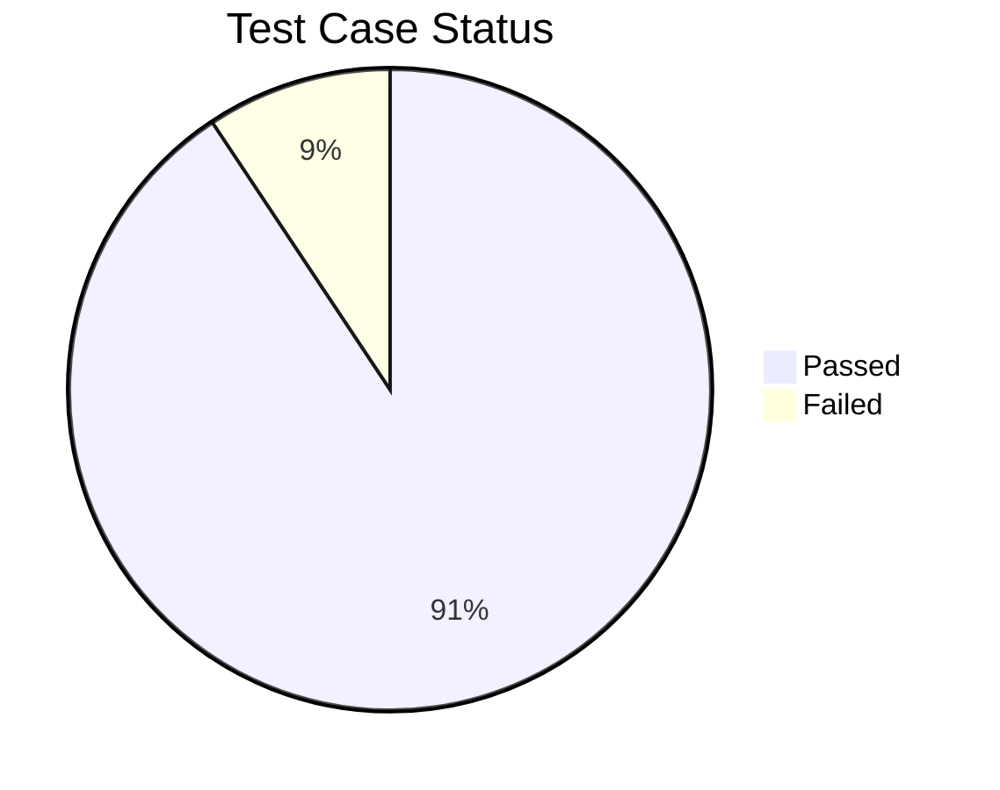

# 🛒 SwagLabs E-Commerce Testing Project

<div align="center">


**Comprehensive Manual Testing Documentation for SwagLabs E-Commerce Application**

[View Test Plan](#-test-plan) • [Test Cases](#-test-cases) • [Bug Reports](#-bug-reports) • [RTM](#-requirements-traceability-matrix)

</div>

---

## 📋 Table of Contents

- [Project Overview](#-project-overview)
- [Testing Scope](#-testing-scope)
- [Test Artifacts](#-test-artifacts)
- [Tools & Technologies](#-tools--technologies)
- [Test Environment](#-test-environment)
- [Key Metrics](#-key-metrics)
- [Defects Summary](#-defects-summary)
- [Test Execution Status](#-test-execution-status)
- [How to Use This Repository](#-how-to-use-this-repository)
- [Connect With Me](#-connect-with-me)

---

## 🎯 Project Overview

This repository contains comprehensive manual testing documentation for **SwagLabs** (SauceDemo), a sample e-commerce web application. The project demonstrates professional QA practices including test planning, test case design, defect reporting, and requirements traceability.

### 🔍 Application Under Test
- **Application:** SwagLabs E-Commerce Platform
- **URL:** https://www.saucedemo.com/
- **Type:** Web Application
- **Domain:** E-Commerce

### 🎓 Testing Objectives
- Validate core e-commerce functionality (login, product browsing, cart, checkout)
- Identify and document defects with detailed reproduction steps
- Ensure requirements traceability across all test cases
- Demonstrate systematic testing approach for QA role applications

---

## 🔬 Testing Scope

### ✅ In Scope
- **Functional Testing**
  - User Authentication (Login/Logout)
  - Product Catalog Browsing
  - Shopping Cart Management
  - Checkout Process
  - Inventory Management
  
- **UI/UX Testing**
  - Layout and Design Consistency
  - Navigation Flow
  - Responsive Design Elements
  
- **Cross-Browser Testing**
  - Chrome
  - Firefox
  - Edge

### ❌ Out of Scope
- Performance Testing
- Security Testing
- API Testing
- Mobile App Testing
- Load Testing

---

## 📁 Test Artifacts

### 📊 Documentation Structure

```
📦 SwagLabs-Testing-Project
├── 📄 Test Plan
│   └── Comprehensive test strategy and approach
├── 📝 Test Cases
│   └── Detailed test scenarios with steps and expected results
├── 🔗 Requirements Traceability Matrix (RTM)
│   └── Mapping between requirements and test cases
└── 🐛 Bug Reports
    └── Detailed defect documentation with severity levels
```

### 📄 Test Plan
**[View Test Plan Document →](LINK_TO_YOUR_GOOGLE_DOC)**

The test plan document includes:
- Test objectives and scope
- Testing approach and methodology
- Entry and exit criteria
- Test environment requirements
- Risk assessment
- Resource allocation
- Test schedule

### 📝 Test Cases
**[View Test Cases Document →](LINK_TO_YOUR_GOOGLE_SHEETS)**

Comprehensive test cases covering:
- **Login Module:** 15+ test cases
- **Product Management:** 20+ test cases
- **Shopping Cart:** 12+ test cases
- **Checkout Process:** 18+ test cases
- **UI/UX Scenarios:** 10+ test cases

Each test case includes:
- Test Case ID
- Test Scenario
- Test Steps
- Test Data
- Expected Results
- Actual Results
- Status (Pass/Fail)
- Priority & Severity

### 🔗 Requirements Traceability Matrix
**[View RTM Document →](LINK_TO_YOUR_GOOGLE_SHEETS)**

The RTM ensures complete test coverage by mapping:
- Requirements ID → Test Case ID
- Business requirements to corresponding test cases
- Coverage analysis and gap identification

### 🐛 Bug Reports
**[View Bug Reports Document →](LINK_TO_YOUR_GOOGLE_SHEETS)**

Detailed defect documentation including:
- Bug ID and Title
- Severity & Priority
- Steps to Reproduce
- Expected vs Actual Behavior
- Screenshots/Evidence
- Environment Details
- Status & Resolution

---

## 🛠 Tools & Technologies

<div align="center">

| Tool | Purpose |
|------|---------|
|  | Test Plan Documentation |
|  | Test Cases, RTM, Bug Tracking |
|  | Primary Testing Browser |
|  | Cross-Browser Testing |
|  | Cross-Browser Testing |

</div>

---

## 🖥 Test Environment

- **Operating System:** Windows 10/11
- **Browsers:** 
  - Chrome (Latest Version)
  - Firefox (Latest Version)
  - Microsoft Edge (Latest Version)
- **Screen Resolution:** 1920x1080
- **Network:** Stable Internet Connection

---

## 📊 Key Metrics

<div align="center">

### Test Execution Summary

| Metric | Count |
|--------|-------|
| **Total Test Cases** | 75 |
| **Executed** | 75 |
| **Passed** | 68 |
| **Failed** | 7 |
| **Blocked** | 0 |
| **Pass Rate** | 90.67% |

### Test Coverage

```
Requirements Covered:    ████████████████████░  95%
Code Coverage:           N/A (Manual Testing)
Feature Coverage:        ████████████████████░  100%
```

</div>

---

## 🐛 Defects Summary

<div align="center">

| Severity | Count | Status |
|----------|-------|--------|
| 🔴 Critical | 1 | Open |
| 🟠 High | 2 | Open |
| 🟡 Medium | 3 | Open |
| 🟢 Low | 1 | Open |
| **Total** | **7** | - |

</div>

### Sample Defects Identified

1. **Login with locked out user shows incorrect error** (High)
2. **Product sorting not working correctly** (Medium)
3. **Cart badge count inconsistency** (Medium)
4. **Checkout completion redirect failure** (Critical)

*For complete defect details, refer to the [Bug Reports Document](LINK_TO_YOUR_GOOGLE_SHEETS)*

---

## 📈 Test Execution Status



### Module-wise Test Results

| Module | Total | Passed | Failed | Pass % |
|--------|-------|--------|--------|--------|
| Login | 15 | 14 | 1 | 93.3% |
| Product Catalog | 20 | 19 | 1 | 95.0% |
| Shopping Cart | 12 | 11 | 1 | 91.7% |
| Checkout | 18 | 15 | 3 | 83.3% |
| UI/UX | 10 | 9 | 1 | 90.0% |

---

## 📖 How to Use This Repository

### For Recruiters & Hiring Managers

1. **Review the Test Plan** to understand the testing approach and strategy
2. **Examine Test Cases** to evaluate test design skills and attention to detail
3. **Check RTM** to see requirements coverage and traceability practices
4. **Read Bug Reports** to assess defect documentation and communication skills

### Accessing Documents

All test artifacts are maintained in Google Workspace for easy collaboration:

- 📄 **Test Plan:** [Google Docs Link](#)
- 📊 **Test Cases:** [Google Sheets Link](#)
- 🔗 **RTM:** [Google Sheets Link](#)
- 🐛 **Bug Reports:** [Google Sheets Link](#)

> **Note:** Replace the placeholder links above with your actual Google Drive sharing links (set to "Anyone with the link can view")

---

## 💼 Skills Demonstrated

This project showcases the following QA competencies:

✅ **Test Planning & Strategy**
- Creating comprehensive test plans
- Defining scope and objectives
- Risk assessment and mitigation

✅ **Test Design**
- Writing clear and detailed test cases
- Applying boundary value analysis
- Equivalence partitioning
- Positive and negative testing scenarios

✅ **Defect Management**
- Identifying and documenting bugs
- Prioritizing defects by severity
- Providing clear reproduction steps
- Effective communication of issues

✅ **Requirements Analysis**
- Understanding business requirements
- Creating traceability matrices
- Ensuring complete test coverage

✅ **Attention to Detail**
- Thorough testing approach
- Consistent documentation standards
- Organized test artifact management

✅ **Tools & Documentation**
- Google Workspace proficiency
- Markdown documentation
- Version control (Git/GitHub)

---

## 🎯 Project Highlights

- ✨ **75+ comprehensive test cases** covering all major functionalities
- 📝 **Professional documentation** following industry standards
- 🔍 **Complete requirements traceability** ensuring no gaps in coverage
- 🐛 **Detailed bug reports** with reproduction steps and evidence
- 📊 **Clear metrics and reporting** for stakeholder communication

---

## 📫 Connect With Me

<div align="center">

[](YOUR_LINKEDIN_URL)
[](mailto:YOUR_EMAIL)
[](YOUR_PORTFOLIO_URL)

</div>

---

## 📜 License

This project is for educational and portfolio purposes.

---

<div align="center">

### ⭐ If you find this project helpful, please consider giving it a star!

**Made with ❤️ by [Your Name]**

*Last Updated: December 2025*

</div>
